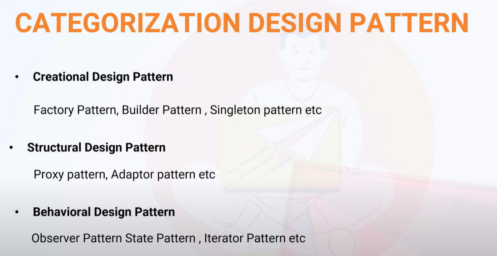

**What is design pattern ?**
**Ans:** 

<h1>Singleton design pattern</h1>

<ol>
    <li>Constructor will always be private. This way, we prevent creating objects of the class.</li>
    <li>To create a Singleton class:
        <ol>
            <li><b>Static member:</b> It gets memory only once because of static. It contains the instance of the Singleton class.</li>
            <li><b>Private constructor:</b> It prevents the instantiation of the Singleton class from outside the class.</li>
            <li><b>Static factory method:</b> This provides the global point of access to the Singleton object and returns the instance to the caller.</li>
        </ol>
    </li>
</ol>

**Types of singleton classes :**
<ol>
    <li><code>Lazy initialization</code>: Creating the instance of the class when required</li>
    <li><code>Eager initialization</code>: Creating the object when application started</li>
</ol>

**How to make Singleton classes thread safety?** 
**ANS** : By using synchronization
